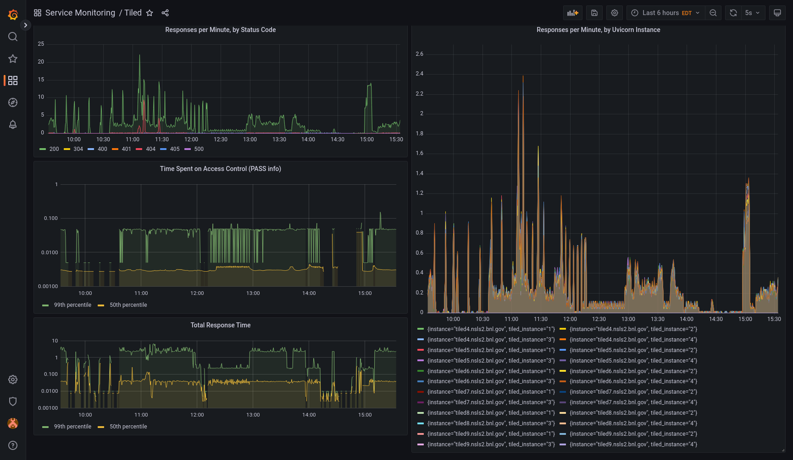

# Prometheus Metrics

Tiled publishes [Prometheus](https://prometheus.io/) metrics that can be used
to monitor many aspects of its usage and performance over time. The metrics
can be visualized in dashboards using, for example,
[Grafana](https://grafana.com/).



Tiled ships with some example configuration to make it easy to try this.

1. Install [Podman](https://podman.io/) (recommended) or Docker (also works).

2. Install `podman-compose` or `docker-compose`. Either can be installed using `pip install`.

3. Run `TILED_SINGLE_USER_API_KEY=secret podman-compose up`.

4. Open Grafana by navigating a web browser to
   [http://localhost:3000/d/Hnvd_TA4z/tiled-dashboard](http://localhost:3000/d/Hnvd_TA4z/tiled-dashboard).

The dashboard will be blank at first. To generate some activity, use the Tiled Python client.
Authenticate using the dummy API key, `secret`.

```python
from tiled.client import from_uri

c = from_uri("http://localhost:8000", api_key="secret")
list(c)
```

To clean up, escape `podman-compose` using Ctrl+C, and then run `podman-compose
down`. This must be run before running `podman-compose up` again. (Ditto for
`docker-compose`.)


```{warning}
**Security Notes**

This example configuration disables authentication in Grafana so that no login
is required to view or edit the dashboard. Do not use it "in production", or
anyone will be able to view (or vandalize) your dashboard.

Also, the example Prometheus configuration in
`monitoring_example/prometheus/prometheus.yml` contains a dummy credential
(`secret`). To run the example, it must match the secret set by
`TILED_SINGLE_USER_API_KEY`.

In real single-user deployments, the secret should be set to a secure value as described in
[Tiled's security documentation](https://blueskyproject.io/tiled/explanations/security.html).
In multi-user deployments, an
[API key](https://blueskyproject.io/tiled/how-to/api-keys.html) with the
`metrics` scope should be used.
```

## How does it work?

1. Tiled securely exposes an endpoint `/api/v1/metrics` with live metrics
   describing the activity and performance of the Tiled server.

2. Prometheus polls this endpoints and stores the results in its database,
   accumulating a history.

3. Grafana queries Prometheus for various metrics derived from this, which it
   then displays in dashboard.
