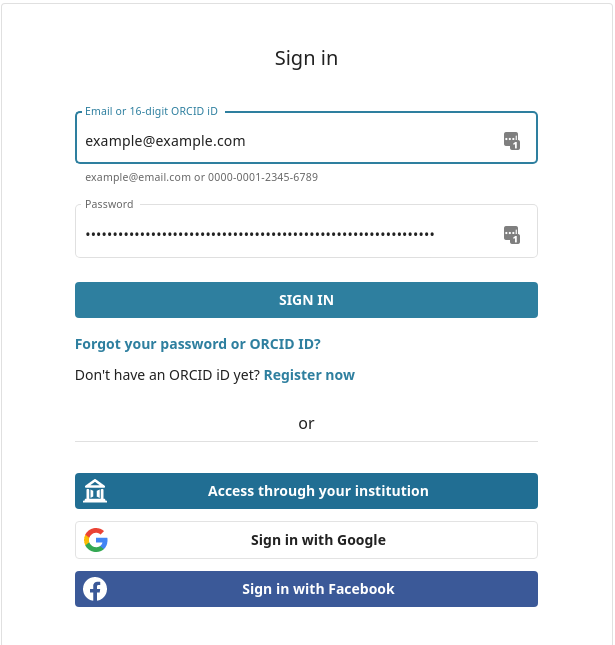
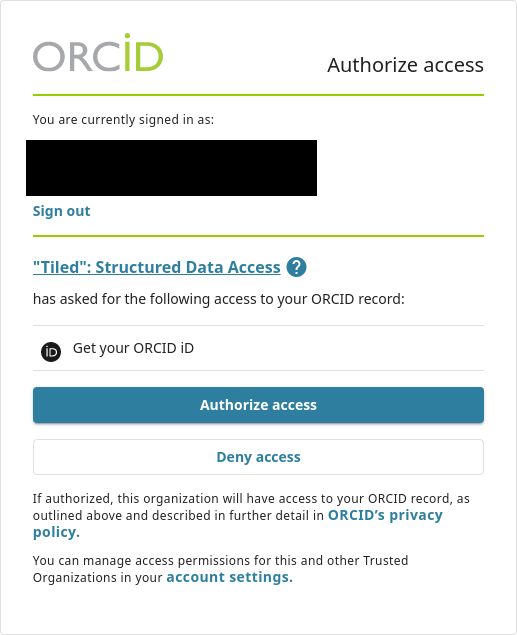

(login-tutorial)=
# Log into an Authenticated Tiled Server

For this tutorial, we will log in to the demo Tiled server at
`https://tiled-demo.blueskyproject.io`. This server is configured to use
[ORCID](https://orcid.org) for authentication, so you will need an ORCID
account.

From Python, connect as usual.

```python
>>> from tiled.client import from_uri
>>> c = from_uri("https://tiled-demo.blueskyproject.io")
```

Now, ask to log in.

```python
>>> c.login()
```

You will see this prompt.

```
You have 15 minutes visit this URL

https://...

and enter the code: XXXX-XXXX
```

A browser tab may opened automatically. Or, you can copy/paste that link into a web browser.

You will prompted to log in to ORCID, unless you are already logged in in
another browser tab.



Once you log in, you will be prompted to authorize Tiled. This enables
Tiled to confirm your identity with ORCID. It's using the same mechanism as
websites that prompt you to "Log in to ___ with Google," for example.



From here, you will be redirected to form asking you enter that access code
of the form `XXXX-XXXX`. This completes the handshake between Tiled and ORCID.

Back in Python, after a couple seconds, you will see a confirmation message:

```
You have logged with ORCID as XXXX-XXXX-XXXX-XXXX.
```

and you can access data.

```
>>> c
<Container {'big_image', 'small_image', 'medium_image', ...} ~13 entries>
```

Next, quit Python and start it fresh.

```python
>>> from tiled.client import from_uri
>>> c = from_uri("https://tiled-demo.blueskyproject.io")
>>> c
<Container {'big_image', 'small_image', 'medium_image', ...} ~13 entries>
```

Notice that you are _not_ prompted to log in again. The login process
stashed a file (under `~/.config/tiled/tokens/tiled-demo.blueskyproject.io/`)
that enables the session to be reused. It expires if unused for some period. By
default it expires after one week of disuse, but this is configurable and can
vary from one Tiled server to another.

Now log out via:

```
>>> c.logout()
```

This Tiled server happens to be configured so that login is optional, and that
anyone with an ORCID (_any_ ORCID) can log in. Other Tiled servers may be configured to
restrict access to a specific list of ORCIDs, and/or to restrict access to some or
all data to certain users. To learn how to _deploy_ authenticated Tiled
servers, see {doc}`../explanations/security`.
