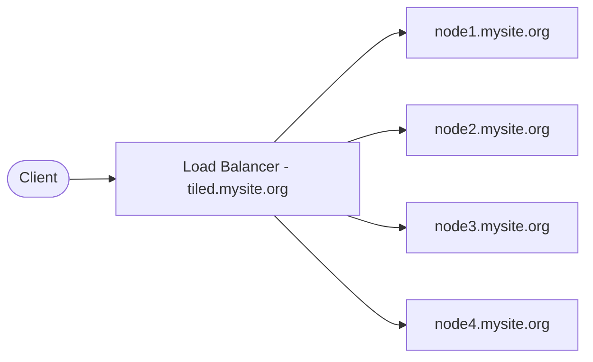

# Scale Tiled over Multiple Nodes

## Overview

As Tiled is designed to be horizontally scalable, it can be deployed across
multiple nodes to handle increased load and provide high availability. This page
provides an overview of how to deploy Tiled in a multi-node configuration.

As Tiled uses the HTTP(S) protocol, it can be easily load balanced across
multiple nodes using a variety of load balancers &mdash; both software and
hardware &mdash; such as Nginx, HAProxy, or cloud-based load balancers. For
these documentation pages, [HAProxy](https://www.haproxy.org/) is used as an
example of a load balancer, but the same principles apply to other load
balancers as well.

## Example of simple Multi-Node Deployment

For a simple deployment, you can set up a single _HAProxy_ load balancer that
distributes incoming requests to multiple Tiled nodes.  For example:



In this setup, the load balancer (LB) receives all incoming requests to
`tiled.mysite.org` and distributes them to the Tiled nodes
`node[1-4].mysite.org`. Each Tiled node runs an instance of the Tiled
application, and the load balancer ensures that requests are evenly distributed
across the nodes. The load balancer also performs health checks to ensure that
it only sends traffic to healthy nodes, by periodically checking the `/healthz`
endpoint on each node.

The benefit of this approach is that it provides a simple way to scale Tiled
horizontally by adding more nodes as needed, and it also provides high
availability by ensuring that if one (or more) nodes go down, the load balancer
can route traffic to the remaining healthy nodes.

The following HAproxy configuration snippet demonstrates how to set up the
load balancer for this configuration:

```haproxy
global
    log /dev/log local0
    maxconn 2048
    daemon

defaults
    mode http
    timeout connect 5s
    timeout client 10s
    timeout server 10s

frontends tiled_frontend
    bind *:80
    bind *:443 ssl crt /etc/haproxy/certs/tiled.mysite.org.pem alpn h2,http/1.1
    default_backend tiled_backend
    option httplog

    # Redirect non https traffic to https
    redirect scheme https code 301 if !{ ssl_fc }

    # This ensures that the links constructed by the Tiled application
    # in its JSON responses use with https, not http.
    http-request set-header X-Forwarded-Proto https if { ssl_fc }

    # HSTS (63072000 seconds)
    http-response set-header Strict-Transport-Security max-age=63072000

backend tiled_backend
    balance roundrobin

    # Add health check to ensure that the load balancer only sends traffic
    # to healthy nodes
    option httpchk
    httpcheck connect
    httpcheck sent meth GET uri /healthz ver HTTP/1.1 hdr Host tiled.mysite.org
    http-check expect status 200

    server node1 node1.mysite.org:5000 check
    server node2 node2.mysite.org:5000 check
    server node3 node3.mysite.org:5000 check
    server node4 node4.mysite.org:5000 check
```

In this configuration, the load balancer listens on both HTTP (port 80) and
HTTPS (port 443) and redirects HTTP traffic to HTTPS. The tiled nodes
(`node[1-4].mysite.org`) are configured as backend servers with tiled listening
on port 5000 on each host.

It also sets the `X-Forwarded-Proto` header to ensure that the Tiled application
generates links with the correct scheme. The backend configuration uses
round-robin load balancing and includes health checks to ensure that traffic is
only sent to healthy nodes.

<!-- TODO: Add why we should scale tiled with multiople processes on a single node -->

When scaling Tiled horizontally, it can often be beneficial to run multiple
tiled processes on a single node. While this is not strictly necessary,
it can help to improve performance and utilize resources more efficiently.

For example, if 4 tiled processes run on each node, listening on ports
5000-5003, the HAProxy configuration would be updated as follows:

```haproxy
global
    log /dev/log local0
    maxconn 2048
    daemon

defaults
    mode http
    timeout connect 5s
    timeout client 10s
    timeout server 10s

resolvers default_dns
  # Configure 2 DNS servers for HAProxy to use for resolving backend server
  # hostnames at runtime.
  nameserver dns1 192.168.0.1:53
  nameserver dns2 192.168.0.2:53
  accepted_payload_size 512

  # The hold directives define how far into the past to look for a valid response.
  # If a valid response has been received within <period>,
  # the just received invalid status will be ignored.
  hold valid    180s
  hold other    180s
  hold refused  180s
  hold nx       180s
  hold timeout  180s
  hold obsolete 180s

frontends tiled_frontend
    bind *:80
    bind *:443 ssl crt /etc/haproxy/certs/tiled.mysite.org.pem alpn h2,http/1.1
    default_backend tiled_backend
    option httplog

    # Redirect non https traffic to https
    redirect scheme https code 301 if !{ ssl_fc }

    # This ensures that the links constructed by the Tiled application
    # in its JSON responses use with https, not http.
    http-request set-header X-Forwarded-Proto https if { ssl_fc }

    # HSTS (63072000 seconds)
    http-response set-header Strict-Transport-Security max-age=63072000

backend tiled_backend
    balance roundrobin

    # Add health check to ensure that the load balancer only sends traffic
    # to healthy nodes
    option httpchk
    httpcheck connect
    httpcheck sent meth GET uri /healthz ver HTTP/1.1 hdr Host tiled.mysite.org
    http-check expect status 200

    server node1 node1.mysite.org:5000 resolvers default_dns check init-addr none resolve-opts allow-dup-ip
    server node1 node1.mysite.org:5001 resolvers default_dns check init-addr none resolve-opts allow-dup-ip
    server node1 node1.mysite.org:5002 resolvers default_dns check init-addr none resolve-opts allow-dup-ip
    server node1 node1.mysite.org:5003 resolvers default_dns check init-addr none resolve-opts allow-dup-ip
    server node2 node2.mysite.org:5000 resolvers default_dns check init-addr none resolve-opts allow-dup-ip
    server node2 node2.mysite.org:5001 resolvers default_dns check init-addr none resolve-opts allow-dup-ip
    server node2 node2.mysite.org:5002 resolvers default_dns check init-addr none resolve-opts allow-dup-ip
    server node2 node2.mysite.org:5003 resolvers default_dns check init-addr none resolve-opts allow-dup-ip
    server node3 node3.mysite.org:5000 resolvers default_dns check init-addr none resolve-opts allow-dup-ip
    server node3 node3.mysite.org:5001 resolvers default_dns check init-addr none resolve-opts allow-dup-ip
    server node3 node3.mysite.org:5002 resolvers default_dns check init-addr none resolve-opts allow-dup-ip
    server node3 node3.mysite.org:5003 resolvers default_dns check init-addr none resolve-opts allow-dup-ip
    server node4 node4.mysite.org:5000 resolvers default_dns check init-addr none resolve-opts allow-dup-ip
    server node4 node4.mysite.org:5001 resolvers default_dns check init-addr none resolve-opts allow-dup-ip
    server node4 node4.mysite.org:5002 resolvers default_dns check init-addr none resolve-opts allow-dup-ip
    server node4 node4.mysite.org:5003 resolvers default_dns check init-addr none resolve-opts allow-dup-ip
```

Ass there are 4 nodes with 4 tiled processes each, there are now 16 server
entries in the backend configuration. In this configuration, it is important to
set some additional options on the server lines to ensure that HAProxy can
properly handle multiple servers with the same hostname and defer DNS resolution
until runtime. This is done via the following options:

- `resolvers default_dns` &mdash; Specifies the DNS resolvers section that
  HAProxy should use for runtime DNS resolution of server hostnames. This must
  reference a `resolvers` section defined elsewhere in the HAProxy configuration.
- `init-addr none` &mdash; Tells HAProxy not to resolve the server's address at
  startup. This allows HAProxy to start even if the backend nodes are not yet
  available, deferring DNS resolution to runtime (requires a `resolvers`
  section).
- `resolve-opts allow-dup-ip` &mdash; Allows multiple server entries in the
  same backend to resolve to the same IP address. By default, HAProxy enforces
  unique IPs per server in a backend. Since multiple Tiled processes on the same
  node share the same hostname (and therefore the same IP), this option is
  required to prevent HAProxy from deactivating duplicate entries.

Deffering DNS resolution to runtime allows HAProxy to handle dynamic changes in
the tiled configuration &mdash; for example, if you need to add or remove tiled
processes on a node, or if the IP address of a node changes &mdash; HAProxy
will automatically resolve the hostnames and update its backend server list
accordingly without needing a restart.
