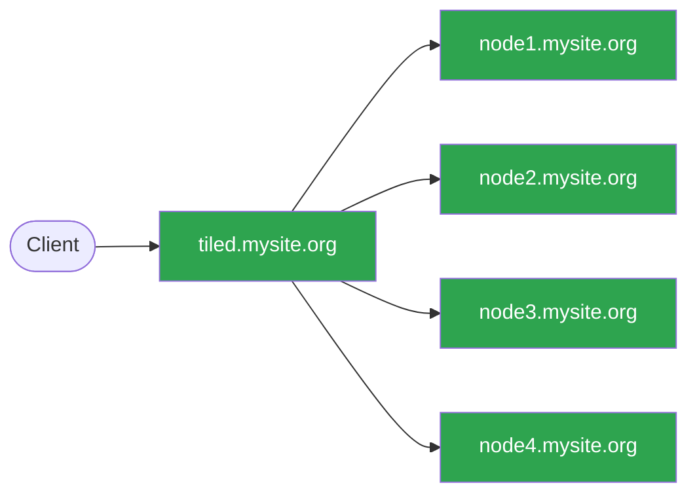
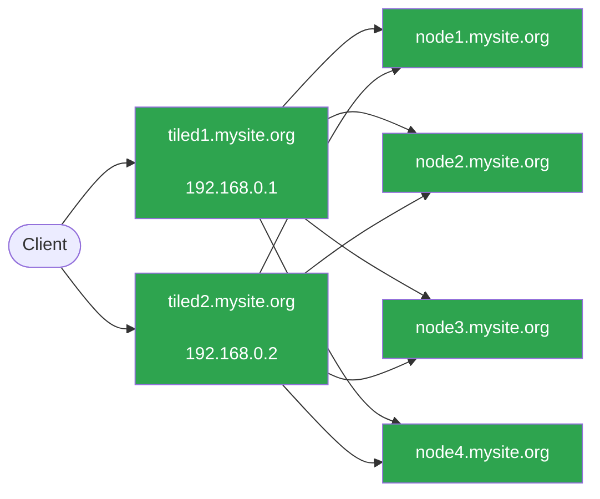
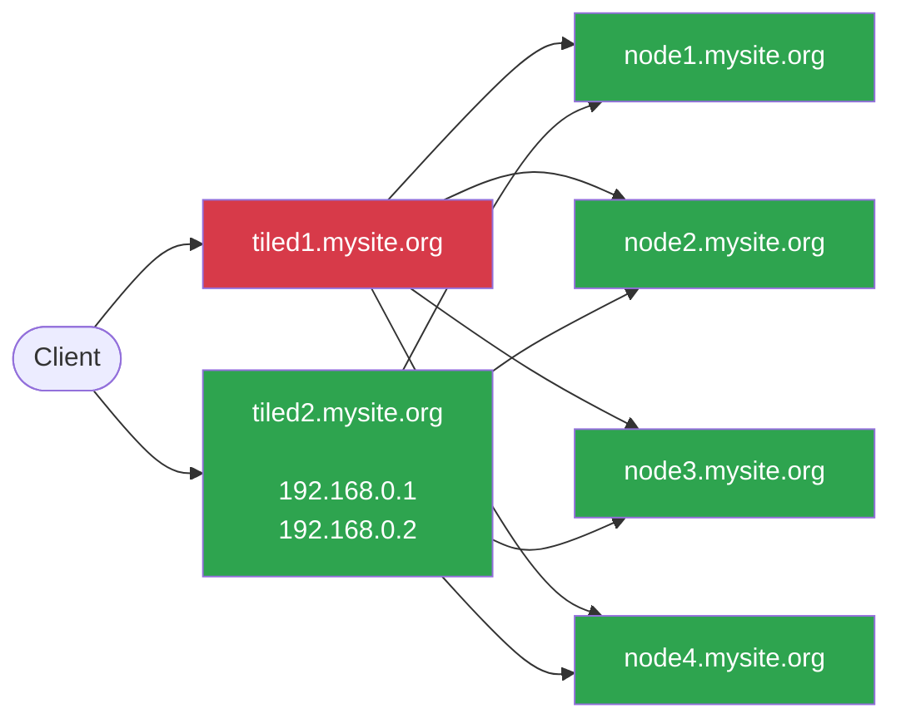

# Scale Tiled over Multiple Nodes

## Overview

As Tiled is designed to be horizontally scalable, it can be deployed across
multiple nodes to handle increased load and provide high availability.
Some of the benefits of this approach are:

* *High Availability (HA)* &mdash; very desirable in production environments as
  it allows Tiled to continue functioning even if one or more nodes fail, often
  without users noticing any disruption.

* *Load Distribution* &mdash; by distributing incoming requests across multiple
  nodes, you can improve performance and reduce latency, especially under heavy
  load.

* *Scalability* &mdash; as demand increases, you can easily add more nodes to
  the cluster to handle the increased load without needing to make significant
  changes or downtime.

* *Bumpless Reboot / Upgrade (Zero Downtime)* &mdash; when you need to reboot or
  upgrade Tiled, you can take down one node at a time while the others continue
  to serve traffic, allowing you to perform maintenance without any downtime.

As Tiled uses the HTTP(S) protocol, it can be easily load balanced across
multiple nodes using a variety of load balancers &mdash; both software and
hardware &mdash; such as Nginx, HAProxy, or cloud-based load balancers. For
these documentation pages, [HAProxy](https://www.haproxy.org/) is used as an
example of a load balancer, but the same principles apply to other load
balancers as well.

## Example of simple Multi-Node Deployment

For a simple deployment, you can set up a single _HAProxy_ load balancer that
distributes incoming requests to multiple Tiled nodes.  For example:



In this setup, the load balancer (LB) receives all incoming requests to
`tiled.mysite.org` and distributes them to the Tiled nodes
`node[1-4].mysite.org`. Each Tiled node runs an instance of the Tiled
application, and the load balancer ensures that requests are evenly distributed
across the nodes. The load balancer also performs health checks to ensure that
it only sends traffic to healthy nodes, by periodically checking the `/healthz`
endpoint on each node.

The benefit of this approach is that it provides a simple way to scale Tiled
horizontally by adding more nodes as needed, and it also provides high
availability by ensuring that if one (or more) nodes go down, the load balancer
can route traffic to the remaining healthy nodes.

The following HAproxy configuration snippet demonstrates how to set up the
load balancer for this configuration:

```text
global
    log /dev/log local0
    maxconn 2048
    daemon

defaults
    mode http
    timeout connect 5s
    timeout client 10s
    timeout server 10s

frontend tiled_frontend
    bind *:80
    bind *:443 ssl crt /etc/haproxy/certs/tiled.mysite.org.pem alpn h2,http/1.1
    default_backend tiled_backend
    option httplog

    # Redirect non https traffic to https
    redirect scheme https code 301 if !{ ssl_fc }

    # This ensures that the links constructed by the Tiled application
    # in its JSON responses use with https, not http.
    http-request set-header X-Forwarded-Proto https if { ssl_fc }

    # HSTS (63072000 seconds)
    http-response set-header Strict-Transport-Security max-age=63072000

backend tiled_backend
    balance roundrobin

    # Add health check to ensure that the load balancer only sends traffic
    # to healthy nodes
    option httpchk
    httpcheck connect
    httpcheck sent meth GET uri /healthz ver HTTP/1.1 hdr Host tiled.mysite.org
    http-check expect status 200

    server node1 node1.mysite.org:5000 check
    server node2 node2.mysite.org:5000 check
    server node3 node3.mysite.org:5000 check
    server node4 node4.mysite.org:5000 check
```

In this configuration, the load balancer listens on both HTTP (port 80) and
HTTPS (port 443) and redirects HTTP traffic to HTTPS. The tiled nodes
(`node[1-4].mysite.org`) are configured as backend servers with tiled listening
on port 5000 on each host.

It also sets the `X-Forwarded-Proto` header to ensure that the Tiled application
generates links with the correct scheme. The backend configuration uses
round-robin load balancing and includes health checks to ensure that traffic is
only sent to healthy nodes.

When scaling Tiled horizontally, it can often be beneficial to run multiple
tiled processes on a single node. We run multiple Tiled processes on a single
node because the Tiled server is implemented in Python, and Python web
applications generally use a single core because of Python’s Global Interpreter
Lock (GIL). This may change in the future: recent versions of Python can
optionally run without the GIL, and the ecosystem of Python libraries is
evolving to leverage this to utilize multiple cores. But at present, we need to
run multiple server processes to utilize multiple cores effectively.

For example, if 4 tiled processes run on each node, listening on ports
5000-5003, the HAProxy configuration would be updated as follows:

```text
global
    log /dev/log local0
    maxconn 2048
    daemon

defaults
    mode http
    timeout connect 5s
    timeout client 10s
    timeout server 10s

resolvers default_dns
  # Configure 2 DNS servers for HAProxy to use for resolving backend server
  # hostnames at runtime.
  nameserver dns1 192.168.0.1:53
  nameserver dns2 192.168.0.2:53
  accepted_payload_size 512

  # The hold directives define how far into the past to look for a valid response.
  # If a valid response has been received within <period>,
  # the just received invalid status will be ignored.
  hold valid    180s
  hold other    180s
  hold refused  180s
  hold nx       180s
  hold timeout  180s
  hold obsolete 180s

frontend tiled_frontend
    bind *:80
    bind *:443 ssl crt /etc/haproxy/certs/tiled.mysite.org.pem alpn h2,http/1.1
    default_backend tiled_backend
    option httplog

    # Redirect non https traffic to https
    redirect scheme https code 301 if !{ ssl_fc }

    # This ensures that the links constructed by the Tiled application
    # in its JSON responses use with https, not http.
    http-request set-header X-Forwarded-Proto https if { ssl_fc }

    # HSTS (63072000 seconds)
    http-response set-header Strict-Transport-Security max-age=63072000

backend tiled_backend
    balance roundrobin

    # Add health check to ensure that the load balancer only sends traffic
    # to healthy nodes
    option httpchk
    httpcheck connect
    httpcheck sent meth GET uri /healthz ver HTTP/1.1 hdr Host tiled.mysite.org
    http-check expect status 200

    server node1 node1.mysite.org:5000 resolvers default_dns check init-addr none resolve-opts allow-dup-ip
    server node1 node1.mysite.org:5001 resolvers default_dns check init-addr none resolve-opts allow-dup-ip
    server node1 node1.mysite.org:5002 resolvers default_dns check init-addr none resolve-opts allow-dup-ip
    server node1 node1.mysite.org:5003 resolvers default_dns check init-addr none resolve-opts allow-dup-ip
    server node2 node2.mysite.org:5000 resolvers default_dns check init-addr none resolve-opts allow-dup-ip
    server node2 node2.mysite.org:5001 resolvers default_dns check init-addr none resolve-opts allow-dup-ip
    server node2 node2.mysite.org:5002 resolvers default_dns check init-addr none resolve-opts allow-dup-ip
    server node2 node2.mysite.org:5003 resolvers default_dns check init-addr none resolve-opts allow-dup-ip
    server node3 node3.mysite.org:5000 resolvers default_dns check init-addr none resolve-opts allow-dup-ip
    server node3 node3.mysite.org:5001 resolvers default_dns check init-addr none resolve-opts allow-dup-ip
    server node3 node3.mysite.org:5002 resolvers default_dns check init-addr none resolve-opts allow-dup-ip
    server node3 node3.mysite.org:5003 resolvers default_dns check init-addr none resolve-opts allow-dup-ip
    server node4 node4.mysite.org:5000 resolvers default_dns check init-addr none resolve-opts allow-dup-ip
    server node4 node4.mysite.org:5001 resolvers default_dns check init-addr none resolve-opts allow-dup-ip
    server node4 node4.mysite.org:5002 resolvers default_dns check init-addr none resolve-opts allow-dup-ip
    server node4 node4.mysite.org:5003 resolvers default_dns check init-addr none resolve-opts allow-dup-ip
```

Ass there are 4 nodes with 4 tiled processes each, there are now 16 server
entries in the backend configuration. In this configuration, it is important to
set some additional options on the server lines to ensure that HAProxy can
properly handle multiple servers with the same hostname and defer DNS resolution
until runtime. This is done via the following options:

- `resolvers default_dns` &mdash; Specifies the DNS resolvers section that
  HAProxy should use for runtime DNS resolution of server hostnames. This must
  reference a `resolvers` section defined elsewhere in the HAProxy configuration.
- `init-addr none` &mdash; Tells HAProxy not to resolve the server's address at
  startup. This allows HAProxy to start even if the backend nodes are not yet
  available, deferring DNS resolution to runtime (requires a `resolvers`
  section).
- `resolve-opts allow-dup-ip` &mdash; Allows multiple server entries in the
  same backend to resolve to the same IP address. By default, HAProxy enforces
  unique IPs per server in a backend. Since multiple Tiled processes on the same
  node share the same hostname (and therefore the same IP), this option is
  required to prevent HAProxy from deactivating duplicate entries.

Deffering DNS resolution to runtime allows HAProxy to handle dynamic changes in
the tiled configuration &mdash; for example, if you need to add or remove tiled
processes on a node, or if the IP address of a node changes &mdash; HAProxy
will automatically resolve the hostnames and update its backend server list
accordingly without needing a restart.

```{tip}
As _HAProxy_ (if configured with the `resolvers` and `init-addr none` options)
will resolve the backend server hostnames at runtime, you can configure many
more tiled nodes in the configuration than you initially have. If the new node
is added to DNS and starts up, HAProxy will automatically start sending traffic
to it without needing to update the HAProxy configuration or restart the
load balancer.
```

## Example of Highly Available Multi-Node Deployment

The example above &emdash; while providing load balancing and scalability
&mdash; does not provide high availability for the load balancer itself. If the
load balancer goes down, the entire Tiled service becomes unavailable, even if
all the backend nodes are healthy and running. To address this, you can deploy
multiple load balancers in a so-called _active-passive_ or _active-active_
configuration, using a virtual IP (VIP) that can failover between the
load balancers. This way, if one load balancer fails, the other can take over
and continue serving traffic without interruption.

To configure Tiled with multiple load balancers, you can set up two (or more)
HAProxy instances, each running on a separate node, and configure them to share
virtual IPs between them using Keepalived.

The following diagram illustrates a simple _active-active_ configuration with
two load balancers with the VIPs `192.168.0.1` and `192.168.0.2`

In the normal state, both load balancers are active and can receive traffic. The
VIPs appear on both load balancers, and incoming requests can be sent to either
VIP. To distribute the traffic between the loadbalancers, it is nessesary to
configure DNS to resolve the Tiled hostname (e.g. `tiled.mysite.org`) to both
VIPs. Clients will then use DNS round-robin to distribute requests between the
two load balancers.  For example, the DNS configuration for `tiled.mysite.org`
would look like this:

```shell
$ host tiled.mysite.org
tiled.mysite.org has address 192,168.0.1
tiled.mysite.org has address 192,168.0.2
```

The following shows this configuration diagrammatically:



In the event that one of the load balancers fails, the VIPs will failover to
the remaining active load balancer, and it will continue to serve traffic to the.
Tiled nodes. For example:



Here the first load balancer (LB1) has failed, but the second load balancer
(LB2) has taken over the VIPs (has both IP addresses) and continues to serve
traffic to the Tiled nodes without interruption. This configuration provides
high availability for the load balancer.

To configure the VIPs, it is nesseasry to install and configure Keepalived on
both load balancer nodes.

```{note}
For an introduction to Keepalived and how to set it up, see the following
[introduction from RedHat](https://www.redhat.com/en/blog/keepalived-basics)
 and the official
[Keepalived documentation](https://www.keepalived.org/documentation.html)
```

On tiled1.mysite.org, the Keepalived configuration
would look like this:

```text
global_defs {
  router_id tiled1
  enable_script_security
  script_user keepalived_script
}

vrrp_track_process chk_haproxy {
    process "haproxy"
    weight 10
}

vrrp_instance 50 {
  state MASTER
  interface ens192
  virtual_router_id 50
  priority 110
  advert_int 1

  virtual_ipaddress {
    192.168.0.1/24
  }

  unicast_src_ip 192.168.0.3
  unicast_peer {
    192.168.0.4
  }

  track_process {
    chk_haproxy
  }
}

vrrp_instance 51 {
  state BACKUP
  interface ens192
  virtual_router_id 51
  priority 109
  advert_int 1

  virtual_ipaddress {
    192.168.0.2/24
  }

  unicast_src_ip 192.168.0.4
  unicast_peer {
    192.168.0.3
  }

  track_process {
    chk_haproxy
  }
}
```

On tiled2.mysite.org, the Keepalived configuration would look like this:

```text
global_defs {
  router_id tiled1
  enable_script_security
  script_user keepalived_script
}

vrrp_track_process chk_haproxy {
    process "haproxy"
    weight 10
}

vrrp_instance 50 {
  state BACKUP
  interface ens192
  virtual_router_id 50
  priority 109
  advert_int 1

  virtual_ipaddress {
    192.168.0.1/24
  }

  unicast_src_ip 192.168.0.3
  unicast_peer {
    192.168.0.4
  }

  track_process {
    chk_haproxy
  }
}

vrrp_instance 51 {
  state MASTER
  interface ens192
  virtual_router_id 51
  priority 110
  advert_int 1

  virtual_ipaddress {
    192.168.0.2/24
  }

  unicast_src_ip 192.168.0.4
  unicast_peer {
    192.168.0.3
  }

  track_process {
    chk_haproxy
  }
}
```

Basically, each load balancer is configured to be the MASTER for one VIP and the
BACKUP for the other VIP. They also track the HAProxy process, so if HAProxy
fails on one load balancer, it will reduce the priority of that load balancer,
causing the other load balancer to take over the VIPs and continue serving
traffic. This provides high availability for the load balancer layer of the
Tiled deployment.

So HAProxy can use the VIPs, the HAProxy configuration on both load
balancers would be updated to bind to the VIPs instead of `*` and add the
`transparent` option to allow binding to the VIP even if it is not on the
local interface when haproxy starts up.

For example on `tiled1.mysite.org`:

```text
frontend tiled_frontend
    bind 192.168.0.1:80 transparent
    bind 192.168.0.1:443 transparent ssl crt /etc/haproxy/certs/tiled.mysite.org.pem alpn h2,http/1.1
```

and likewise on `tiled2.mysite.org`:

```text
frontend tiled_frontend
    bind 192.168.0.2:80 transparent
    bind 192.168.0.2:443 transparent ssl crt /etc/haproxy/certs/tiled.mysite.org.pem alpn h2,http/1.1
```

Finally, the linux kernel on both load balancer nodes must be configured to
allow HAProxy to bind to the VIPs in transparent mode. This is done by enabling
the `net.ipv4.ip_nonlocal_bind` sysctl permanently by adding the following line
to `/etc/sysctl.conf`:

```text
net.ipv4.ip_nonlocal_bind=1
```

## Using use specifc backend clusters

In some cases, you may want to route traffic to specific backend clusters based
on the use. For example, you may have a cluster of nodes that are dedicated to
handling writing (ingesting) data from data collection and another which is
dedicated to serving clients reading data. There are two ways of configuring
this:

Option 1 is to configure separate DNS names for the different use cases (e.g.
`write.tiled.mysite.org` and `read.tiled.mysite.org`) and configure the load
balancer to route traffic to the appropriate backend cluster based on the
hostname in the request. This can be done by configuring multiple backends with
ACLs in the HAProxy configuration to route traffic based on the `Host` header
in the request. For example:

```text
frontend tiled_frontend
    bind *:80
    bind *:443 ssl crt /etc/haproxy/certs/tiled.mysite.org.pem alpn h2,http/1.1
    default_backend tiled_read_backend
    option httplog

    # Redirect non https traffic to https
    redirect scheme https code 301 if !{ ssl_fc }

    # This ensures that the links constructed by the Tiled application
    # in its JSON responses use with https, not http.
    http-request set-header X-Forwarded-Proto https if { ssl_fc }

    # HSTS (63072000 seconds)
    http-response set-header Strict-Transport-Security max-age=63072000

    acl is_write hdr(host) -i write.tiled.mysite.org
    use_backend tiled_write_backend if is_write

    acl is_read hdr(host) -i read.tiled.mysite.org
    use_backend tiled_read_backend if is_read

backend tiled_read_backend
    balance roundrobin

    # Add health check to ensure that the load balancer only sends traffic
    # to healthy nodes
    option httpchk
    httpcheck connect
    httpcheck sent meth GET uri /healthz ver HTTP/1.1 hdr Host tiled.mysite.org
    http-check expect status 200

    server node1 node1.mysite.org:5000 resolvers default_dns check init-addr none resolve-opts allow-dup-ip
    server node2 node2.mysite.org:5000 resolvers default_dns check init-addr none resolve-opts allow-dup-ip
    server node3 node3.mysite.org:5000 resolvers default_dns check init-addr none resolve-opts allow-dup-ip
    server node4 node4.mysite.org:5000 resolvers default_dns check init-addr none resolve-opts allow-dup-ip

backend tiled_write_backend
    balance roundrobin

    # Add health check to ensure that the load balancer only sends traffic
    # to healthy nodes
    option httpchk
    httpcheck connect
    httpcheck sent meth GET uri /healthz ver HTTP/1.1 hdr Host tiled.mysite.org
    http-check expect status 200

    server node5 node5.mysite.org:5000 resolvers default_dns check init-addr none resolve-opts allow-dup-ip
    server node6 node6.mysite.org:5000 resolvers default_dns check init-addr none resolve-opts allow-dup-ip
    server node7 node7.mysite.org:5000 resolvers default_dns check init-addr none resolve-opts allow-dup-ip
    server node8 node8.mysite.org:5000 resolvers default_dns check init-addr none resolve-opts allow-dup-ip
```

Here nodes 1-4 are dedicated to handling read traffic and nodes 5-8 are
dedicated to handling write traffic. The load balancer routes traffic to the
appropriate backend based on the hostname in the request. To use a single IP
address (or multiple VIPs in a highly available load balancer configuration) for
both hostnames, you can configure DNS to resolve both `write.tiled.mysite.org`
and `read.tiled.mysite.org` to the same IP address (or VIPs). This can be done
with either multiple A records or a CNAME record. For example to use A records:

```shell
$ host write.tiled.mysite.org
write.tiled.mysite.org has address 192.168.0.1

$ host read.tiled.mysite.org
read.tiled.mysite.org has address 192.168.0.1
```

or to use CNAMEs:

```shell
$ host tiled.mysite.org
tiled.mysite.org has address 192.168.0.1

$ host write.tiled.mysite.org
write.tiled.mysite.org is an alias for tiled.mysite.org.

$ host read.tiled.mysite.org
read.tiled.mysite.org is an alias for tiled.mysite.org.
```

The second method (employed at the NSLS-II to ensure data written from beamline
data collection is routed to the write cluster and data read by users is routed
to the read cluster) is to use a single hostname (e.g. `tiled.mysite.org`) and
add an optional header `tiled-use` with a known passphrase to route to the
appropriate cluster. This allows for clients to configure at request time which
cluster to use from a single http client pool.

The configuration for this would look like the following:

```text
frontend tiled_frontend
    bind *:80
    bind *:443 ssl crt /etc/haproxy/certs/tiled.mysite.org.pem alpn h2,http/1.1
    option httplog

    # Redirect non https traffic to https
    redirect scheme https code 301 if !{ ssl_fc }

    # This ensures that the links constructed by the Tiled application
    # in its JSON responses use with https, not http.
    http-request set-header X-Forwarded-Proto https if { ssl_fc }

    # HSTS (63072000 seconds)
    http-response set-header Strict-Transport-Security max-age=63072000

    default_backend tiled_read_backend
    acl is_write hdr(tiled-use) -i MY_WRITE_PASSPHRASE
    use_backend tiled_write_backend if is_write

backend tiled_read_backend
    balance roundrobin

    # Add health check to ensure that the load balancer only sends traffic
    # to healthy nodes
    option httpchk
    httpcheck connect
    httpcheck sent meth GET uri /healthz ver HTTP/1.1 hdr Host tiled.mysite.org
    http-check expect status 200

    server node1 node1.mysite.org:5000 resolvers default_dns check init-addr none resolve-opts allow-dup-ip
    server node2 node2.mysite.org:5000 resolvers default_dns check init-addr none resolve-opts allow-dup-ip
    server node3 node3.mysite.org:5000 resolvers default_dns check init-addr none resolve-opts allow-dup-ip
    server node4 node4.mysite.org:5000 resolvers default_dns check init-addr none resolve-opts allow-dup-ip

backend tiled_write_backend
    balance roundrobin

    # Add health check to ensure that the load balancer only sends traffic
    # to healthy nodes
    option httpchk
    httpcheck connect
    httpcheck sent meth GET uri /healthz ver HTTP/1.1 hdr Host tiled.mysite.org
    http-check expect status 200

    server node5 node5.mysite.org:5000 resolvers default_dns check init-addr none resolve-opts allow-dup-ip
    server node6 node6.mysite.org:5000 resolvers default_dns check init-addr none resolve-opts allow-dup-ip
    server node7 node7.mysite.org:5000 resolvers default_dns check init-addr none resolve-opts allow-dup-ip
    server node8 node8.mysite.org:5000 resolvers default_dns check init-addr none resolve-opts allow-dup-ip
```

Here, requests using the `tiled-use` header with the value `MY_WRITE_PASSPHRASE`
will be routed to the write backend. For example, using curl:

```shell
$ curl -H "tiled-use: MY_WRITE_PASSPHRASE" https://tiled.mysite.org/some/endpoint
```

would route to the write backend, while a request without the header or with a
different value would route to the read backend:

```shell
$ curl https://tiled.mysite.org/some/endpoint
```
