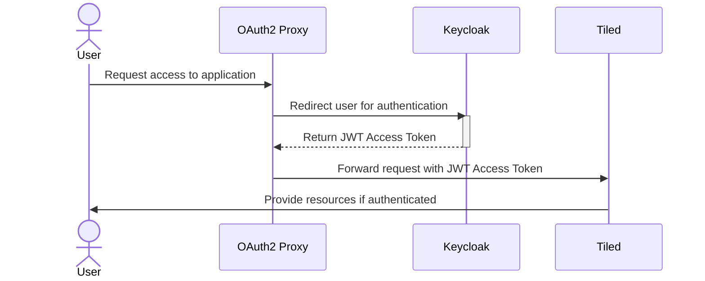

# Running a Local Keycloak Instance for Authentication

This example demonstrates how to set up authentication using Keycloak (or any OAuth2-compliant provider). Two clients require authentication:
1. Tiled CLI (command-line client)
2. Tiled Web UI (FastAPI server and frontend)

## Tiled CLI Authentication

The Tiled CLI uses the [device authorization flow](https://auth0.com/docs/get-started/authentication-and-authorization-flow/device-authorization-flow):

After login, subsequent requests include the access token in the Authorization header. When the token expires (1-minute validity), the CLI automatically refreshes it. You must create a public client in Keycloak with OAuth 2.0 Device Authorization Grant enabled (named `tiled-cli` in this example).

## Tiled Web UI Authentication

The web server uses a simpler flow with a confidential Keycloak client (named `tiled` in this example) and OAuth2 Proxy:

## Getting Started

1. Run `docker compose up` in this directory. This starts:
   - **Keycloak**: Authentication provider
   - **oauth2-proxy**: Authentication proxy

2. Start the Tiled server with `example_configs/keycloak_oidc/config.yaml`.

3. Open [http://localhost:4180](http://localhost:4180) in your browser and log in with:
   - Username: `admin`
   - Password: `admin`

4. After authentication, you'll access all resources. Three additional test users are available:
   - **alice** (password: alice)
   - **bob** (password: bob)
   - **carol** (password: carol)

> **Note:** This example exposes secrets and passwords for demonstration only. **Do not use in production.**
