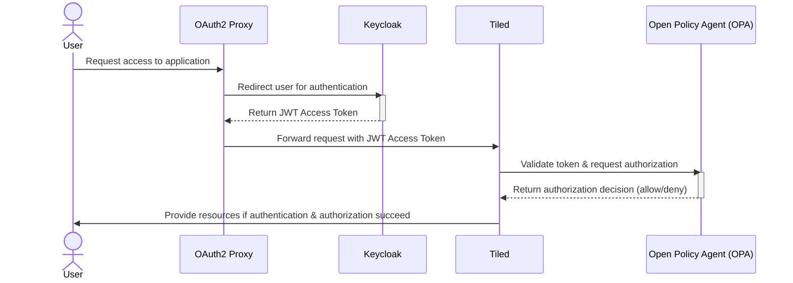

# Running a Local Keycloak Instance for Authentication and OPA for Authorization

1. In this directory, run `docker compose up`.

This will start three services defined in the Docker Compose file:
- **Keycloak**: Handles authentication.
- **oauth2-proxy**: Acts as a proxy to authenticate users.
- **OPA (Open Policy Agent)**: Manages authorization based on defined policies. The current example uses role-based access control, granting permissions according to user roles.

2. Start the Tiled server using the configuration file located at `example_configs/keycloak_oidc/config.yaml`.
3. Open your browser and go to [http://localhost:4180](http://localhost:4180) (served by oauth2-proxy). You will be prompted to log in. Use `admin` for both the username and password.

4. After logging in as `admin`, you will have access to all resources.

The diagram below illustrates how the different services work together to provide authentication and authorization for the Tiled server.

> **Note:** This configuration exposes all secrets and passwords to make it easier to use as an example. **Do not use this setup in production.**
