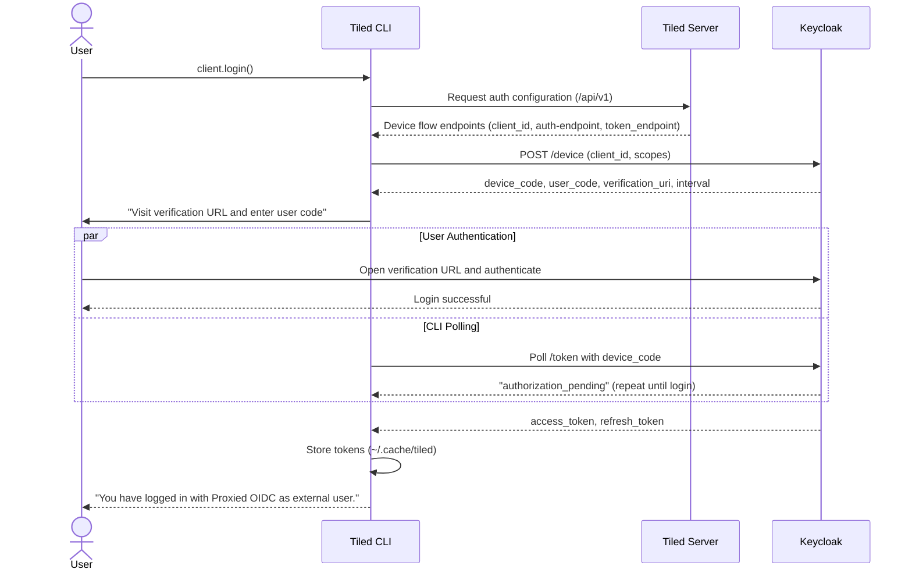
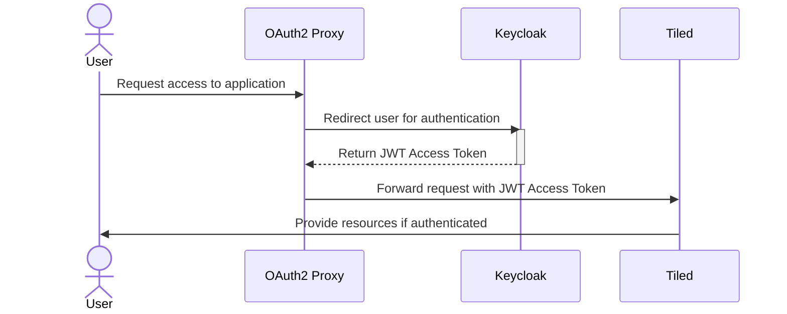

# Running a Local Keycloak Instance for Authentication and Open Policy Agent for Authorization

This example demonstrates how to set up authentication using Keycloak (or any OAuth2-compliant provider). Two clients require authentication:
1. Tiled CLI (command-line client)
2. Tiled Web UI (FastAPI server and frontend)

## Tiled CLI Authentication

The Tiled CLI uses the [device authorization flow](https://auth0.com/docs/get-started/authentication-and-authorization-flow/device-authorization-flow):



After login, subsequent requests include the access token in the Authorization header. When the token expires (1-minute validity), the CLI automatically refreshes it. You must create a public client in Keycloak with OAuth 2.0 Device Authorization Grant enabled (named `tiled-cli` in this example).

## Tiled Web UI Authentication

The Tiled Web UI uses [OAuth2 Proxy](https://oauth2-proxy.github.io/oauth2-proxy/) as a reverse proxy to the Tiled server. OAuth2 Proxy handles all session management, including login, logout, and access token refresh.
The web server uses a confidential Keycloak client (named `tiled` in this example).
To logout, users are redirected to the Keycloak end_session_endpoint via OAuth2 Proxy's sign-out handler:

```
http://localhost:4180/oauth2/sign_out?rd=http%3A%2F%2Flocalhost%3A8080%2Frealms%2Fmaster%2Fprotocol%2Fopenid-connect%2Flogout

# The logout URL can be build as follow:-
end_session_endpoint = "http://localhost:8080/realms/master/protocol/openid-connect/logout"
# end_session_endpoint can be found at http://localhost:8080/realms/master/.well-known/openid-configuration
encoded_url = urllib.parse.quote_plus(end_session_endpoint)

logout_url= "http://localhost:4180" + "oauth2/sign_out?rd=" + encoded_url
```

For better user experience, you can configure a `/logout` endpoint to redirect to this URL automatically.



## Getting Started

1. Run `docker compose up` in this directory. This starts:
    - **Keycloak**: Identity Provider (IdP)
    - **OAuth2-proxy**: Reverse-proxy to access OAuth2 secured Tiled
    - **Open Policy Agent**: Manages authorization based on defined policies. The current example uses role-based access control, granting permissions according to user roles.
2. Start the Tiled server with `tiled server config example_configs/keycloak_oidc/config.yaml`. Set the Python path first by running `export PYTHONPATH="$(PWD)example_configs/keycloak_oidc"` so Tiled can locate the `ExternalPolicyDecisionPoint` implementation. Upon startup, Tiled will retrieve the OpenID Connect configuration from Keycloak's `.well-known/openid-configuration` endpoint.

3. Open http://localhost:4180 (OAuth2 proxy address) in your browser and log in with the following users
    - **admin** (password: admin)
    - **alice** (password: alice)
    - **bob** (password: bob)
    - **cara** (password: cara)

4. After authentication, access to resources depends on your user role. Users can only create nodes with valid tags they have permissions to access.

Valid tags: `["beamline_x_user", "beamline_y_user", "facility_admin", "public"]`

The [example_data.py](example_data.py) script creates sample data with these access levels:

| Data | Access Blob     |
|------|-----------------|
| A    | public          |
| B    | beamline_x_user |
| C    | beamline_y_user |

Access permissions by user:

| User  | Accessible Data | Allowed Tags    |
|-------|-----------------|-----------------|
| admin | A, B, C         | All valid tags  |
| alice | A, B            | beamline_x_user |
| bob   | A, C            | beamline_y_user |
| cara  | A, B, C         | All valid tags  |

The [RBAC policy](policy/rbac/rbac.rego) enforces three authorization rules:
1. **tags** - Returns all tags a user can access
2. **scopes** - Determines user permissions for a specific node
3. **allow** - Permits or denies node creation/modification


> **Note:** This example exposes secrets and passwords for demonstration only. **Do not use in production.**
